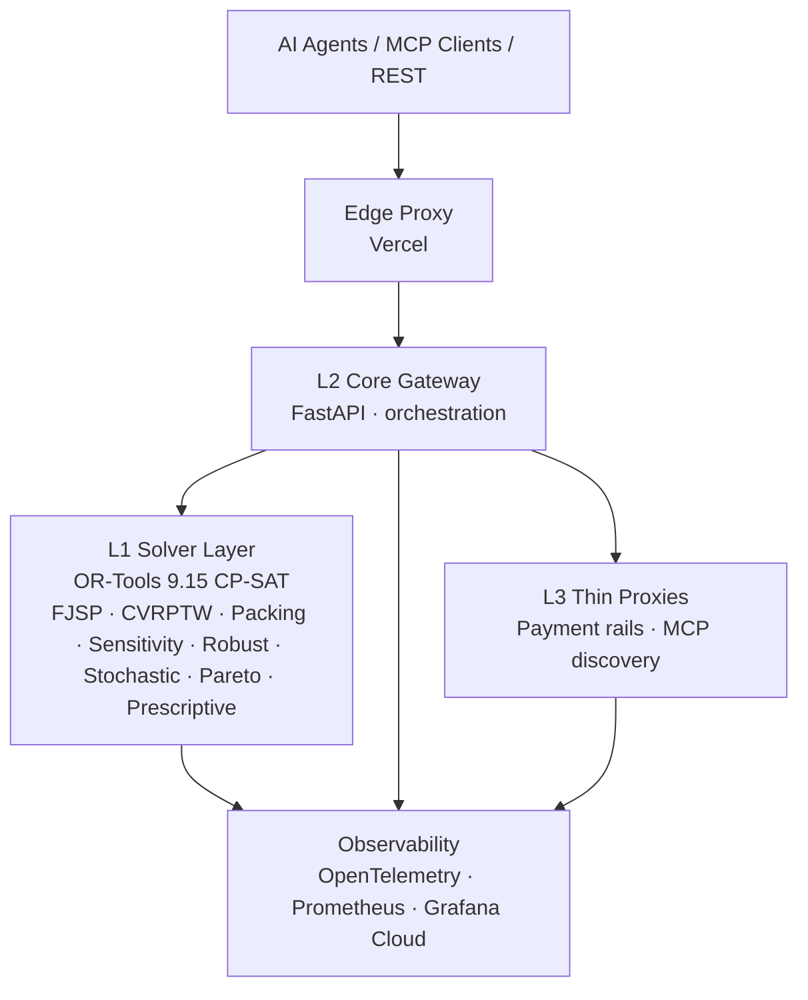

# ⚡ OptimEngine

**Production optimization platform — 4-layer architecture, OR-Tools CP-SAT, MCP-native, OAuth 2.1, observability-first.**

[](https://github.com/MicheleCampi/optim-engine/actions/workflows/tests.yml)
[](https://www.python.org/downloads/)
[](LICENSE)
[](https://modelcontextprotocol.io)
[](https://optim-engine-production.up.railway.app)

---

## Overview

OptimEngine solves NP-hard optimization problems (scheduling, routing, packing) and quantifies risk under uncertainty (sensitivity, robust, stochastic, Pareto). It exposes 11 tools across 4 intelligence levels (L1 deterministic → L3 prescriptive) over both REST and MCP (SSE + Streamable HTTP with OAuth 2.1).

The system is built around three engineering principles: **mathematical correctness** (real CP-SAT solvers, not LLM approximations), **production hygiene** (full observability stack, test coverage on business logic, load-tested), and **agent-friendliness** (MCP dual-stack, OAuth, rate limiting, JSON-only contracts).

## Architecture



Four layers plus edge proxy, deployed across 6 Railway services + 1 Vercel function. All layers instrumented with OpenTelemetry tracing, Prometheus middleware, and Telegram alerting on payment events.

## Tech Stack

| Layer            | Technologies                                                      |
|------------------|-------------------------------------------------------------------|
| Runtime          | Python 3.12, FastAPI, Uvicorn                                     |
| Solvers          | OR-Tools 9.15 CP-SAT, NumPy, custom Monte Carlo                   |
| MCP              | FastMCP (SSE + Streamable HTTP), ScaleKit OAuth 2.1, PyJWT        |
| Validation       | Pydantic v2                                                       |
| Observability    | OpenTelemetry SDK, Prometheus client, Grafana Cloud               |
| Load testing     | Locust 2.43                                                       |
| CI               | GitHub Actions, pytest, pytest-cov                                |
| Deploy           | Railway (compute), Vercel (edge), GitHub Actions (CI)             |

## Capabilities

### L1 — Deterministic Optimization

| Solver       | Problem                  | Key features                                                                                          |
|--------------|--------------------------|-------------------------------------------------------------------------------------------------------|
| Scheduling   | Flexible Job Shop (FJSP) | Precedence, time windows, per-machine durations, availability windows, quality gates, setup matrix    |
| Routing      | CVRPTW                   | Capacity, time windows, GPS distances, drop visits, 4 objectives                                      |
| Bin Packing  | Multi-dim packing        | Weight + volume constraints, item quantities, groups, partial packing, 4 objectives                   |

### L2 — Optimization under Uncertainty

| Module                  | Capability                                       | Output                                                          |
|-------------------------|--------------------------------------------------|-----------------------------------------------------------------|
| Sensitivity Analysis    | One-at-a-time parameter perturbation             | Fragility map, sensitivity scores, critical flags, risk ranking |
| Robust Optimization     | Uncertainty ranges → worst-case protection       | Robust solution, price of robustness, feasibility rate          |
| Stochastic Optimization | Probability distributions → Monte Carlo          | Expected value, VaR, CVaR (90/95/99 %), distribution summary    |

### L2.5 — Multi-objective

| Module          | Capability                       | Output                                                          |
|-----------------|----------------------------------|-----------------------------------------------------------------|
| Pareto Frontier | 2-4 competing objectives         | Non-dominated solutions, trade-off ratios, correlation analysis |

### L3 — Prescriptive

| Module               | Capability                                                       | Output                                                              |
|----------------------|------------------------------------------------------------------|---------------------------------------------------------------------|
| Prescriptive Advise  | Historical data → Forecast → Optimize → Risk → Recommend         | Actions, risk-adjusted makespan, feasibility risk assessment        |

## Performance

Production benchmark summary (full report: [`BENCHMARKS.md`](./BENCHMARKS.md)):

- **757 requests served, 0 failures** across 20 minutes of cumulative load
- **Infrastructure floor: ~200 ms** (FastAPI + edge proxy + auth + observability overhead)
- **Saturation knee at 5 concurrent users** on current Railway tier; system degrades gracefully past it
- **Bottleneck: solver CPU**, not infrastructure — scaling path is horizontal at L1, not vertical at the gateway

Live Grafana dashboard: [public-dashboards/optimengine](https://optimengine.grafana.net/public-dashboards/21137ba340fc4b6e917a4b108db3e109)

## Testing & CI

[](https://github.com/MicheleCampi/optim-engine/actions/workflows/tests.yml)

- **121 tests** across 7 solver modules, all passing
- **77 % overall coverage**, **88 % average on business-logic engines**
- Runs on every push and pull request via GitHub Actions
- Coverage reports uploaded as build artifacts (HTML + XML)

The test suite exercises real CP-SAT solves, not mocks: assertions verify mathematical properties (CVaR ordering, capacity constraints, monotonicity under perturbation) rather than just code paths.

## v9.0.0 Highlights

Four scheduling-engine upgrades that close the gap between academic FJSP and how real workshops operate. All backward compatible with v8 requests.

**Duration per machine** — same task, different times on different machines:

```json
{
  "task_id": "milling",
  "duration": 100,
  "eligible_machines": ["CNC-1", "CNC-2"],
  "duration_per_machine": {"CNC-1": 120, "CNC-2": 80}
}
```

**Availability windows** — multiple shifts and maintenance gaps per machine:

```json
{
  "machine_id": "CNC-1",
  "availability_windows": [
    {"start": 0, "end": 480},
    {"start": 510, "end": 960}
  ]
}
```

**Quality gates** — jobs require minimum quality, machines have yield rates:

```json
{ "job_id": "ORD-BOSCH", "quality_min": 0.97 }
{ "machine_id": "CNC-4", "yield_rate": 0.99 }
```

**Setup-time matrix** — sequence-dependent changeover costs:

```json
{
  "setup_times": [
    {"machine_id": "M1", "from_job_id": "J1", "to_job_id": "J2", "setup_time": 15}
  ]
}
```

## Quick Start

### claude.ai (Remote MCP connector)

Add as a Remote MCP connector under Settings → Integrations:

```
https://optim-engine-production.up.railway.app/mcp
```

For OAuth-protected endpoint:

```
https://optim-engine-production.up.railway.app/mcp/v2
```

### REST (curl)

```bash
curl -X POST https://optim-engine-production.up.railway.app/optimize_schedule \
  -H "Content-Type: application/json" \
  -H "X-Engine-Key: $ENGINE_API_KEY" \
  -d '{
    "jobs": [
      {"job_id": "J1", "tasks": [
        {"task_id": "cut", "duration": 30, "eligible_machines": ["M1", "M2"]},
        {"task_id": "weld", "duration": 20, "eligible_machines": ["M2"]}
      ]}
    ],
    "machines": [{"machine_id": "M1"}, {"machine_id": "M2"}],
    "objective": "minimize_makespan"
  }'
```

### MCP client config

```json
{
  "mcpServers": {
    "optim-engine": {
      "url": "https://optim-engine-production.up.railway.app/mcp"
    }
  }
}
```

## Validation Case Study: MetalPrecision (synthetic)

Synthetic dataset modeled after Italian precision-machining workshops — 4 CNC centers (2015-2023 vintages), 5 client orders modeled on real automotive/industrial customers, 15 tasks. Used to validate solver behavior end-to-end across all 7 modules.

| Tool                    | Result                                                                          |
|-------------------------|---------------------------------------------------------------------------------|
| `optimize_schedule`     | Optimal makespan 225 min, 5/5 on-time, 83.3 % avg utilization, 0.04 s           |
| `validate_schedule`     | Zero violations, 2 improvement suggestions                                       |
| `analyze_sensitivity`   | 73 solves in 3.6 s, most sensitive parameter identified (sensitivity score 8.9)  |
| `optimize_robust`       | Worst-case 210 min, price of robustness 7.7 %, 100 % feasibility                 |
| `optimize_pareto`       | Trade-off frontier: 195/15 min vs 220/0 min, correlation -1.0                    |
| `optimize_stochastic`   | 30 Monte Carlo scenarios, CVaR95 = 188.5, CV 4.7 %                               |
| `prescriptive_advise`   | Forecast +1.3 %/period, risk-adjusted range 167-183                              |

> Customer names in the dataset are illustrative. This is not a live customer deployment; it's a benchmark scenario used for solver validation and demo purposes.

## Production Deployment

| Endpoint                                          | Role                                              |
|---------------------------------------------------|---------------------------------------------------|
| `optim-engine-production.up.railway.app`          | L1 + L2 + L3 compute (Railway, 6 services)        |
| Edge proxy (Vercel)                               | CORS handling, header rewriting, edge caching     |
| MCP connector on claude.ai                        | Tool surface for Claude clients                   |

## Discovery

Listed for agent-economy discovery on **x402scan**, **Smithery**, and **the402.ai**. The system supports x402 micropayments on Base and Solana for paid-tier endpoints; payment integration is documented in the L3 thin-proxy layer but is not the project's primary focus.

## License

MIT — see [LICENSE](LICENSE).

Built by [Michele Campi](https://github.com/MicheleCampi).
